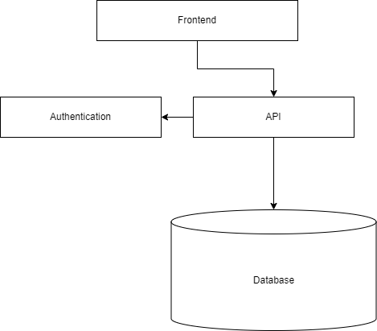

# Communication System

## Basic features / must haves

* User können Nachrichten für alle sichtbar senden
* User können eigene Nachrichten löschen
* User können eigene Nachrichten editieren
* Moderator*innen können alle Nachrichten löschen
* Moderator*innen können User sperren

## Systemdiagram

